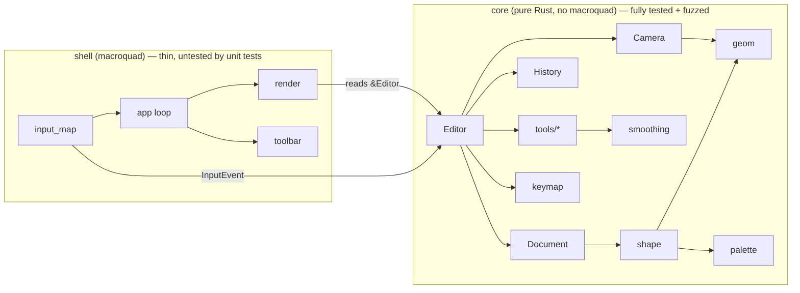

# Architecture

> This note describes the *current* architecture. Its history lives in the
> [[Decision Log]]; when an ADR changes something here, update this note in the
> same task and link the ADR.

## Shape of the program

- **core** knows nothing about windows, GPUs or macroquad. It consumes
  `InputEvent`s and exposes state. Everything here is unit-tested and fuzzed.
- **shell** translates macroquad input into `InputEvent`s, feeds the `Editor`,
  and draws its state. It contains no editing logic.

## Module map (owner task in parentheses)

| Module | Responsibility |
|--------|----------------|
| `core::geom` ([[T01 Geometry primitives]]) | `Vec2`, `Aabb`, distance to segment, finite-float helpers |
| `core::palette` ([[T02 Palette and theme tokens]]) | Fixed drawing colours + UI theme tokens |
| `core::camera` ([[T03 Camera]]) | World ↔ screen transform, pan, zoom-at-cursor, clamping |
| `core::smoothing` ([[T04 Stroke smoothing]]) | Anti-tremor: resample, EMA, Douglas–Peucker |
| `core::shape` ([[T05 Shape model]]) | `Shape` enum, style, bounds, hit-test, inside-test, translate |
| `core::document`, `core::history` ([[T06 Document and history]]) | Ordered shape store with ids; transactional undo/redo |
| `core::input`, `core::command`, `core::editor`, `core::tools::{mod,navigate}` ([[T08 Editor core and input model]]) | Input model, command enum, editor state + dispatch, pan/zoom |
| `core::tools::{pen,shape_tool}` ([[T09 Creation tools]]) | Pen, rectangle, ellipse, line, arrow |
| `core::tools::{eraser,bucket,select}`, `core::clipboard` ([[T10 Editing tools]]) | Erase, fill, select/move, copy/paste/duplicate |
| `core::keymap` ([[T11 Keymap and macros]]) | Key chords → `Command` |
| `shell::render` ([[T07 Renderer]]) | Draw shapes and previews through the camera |
| `shell::{app,input_map,toolbar}` ([[T12 App shell and toolbar]]) | Window, event loop, toolbar UI |
| `tests/fuzz.rs` ([[T13 Fuzz harness]]) | Random input-sequence fuzzing of `Editor` |

## Data flow per frame

The loop sleeps in miniquad's blocking event loop and wakes only on input or
resize ([[ADR-T12-1 Blocking event loop with cached frame]]). Per woken frame:

1. `shell::input_map::Collector` yields every raw event since the last frame,
   in order, as `InputEvent`s in logical screen pixels.
2. `shell::toolbar::route` sends presses on the visible toolbar to
   `Editor::apply(command)`; everything else goes to `Editor::handle(event)`.
   Both return whether anything changed.
3. If anything changed (or the window size did), the scene — shapes minus
   `overlay.hidden`, overlay shapes, selection, marquee, toolbar — is
   re-rendered into a cached, 4× multisampled render target
   ([[ADR-0006 Redraw on demand]], [[ADR-T15-1 MSAA on the cached frame]]).
   Ideas to make this cheaper: [[Rendering performance options]].
4. The cached texture is blitted to the window (one quad).

## Invariants (checked by the fuzzer)

- No panic for any input sequence, including NaN/∞/huge coordinates.
- All stored coordinates are finite.
- Undo all → empty document; redo all → identical document.
- Camera zoom stays within `[ZOOM_MIN, ZOOM_MAX]`.
- Selection only refers to shape ids that exist.
