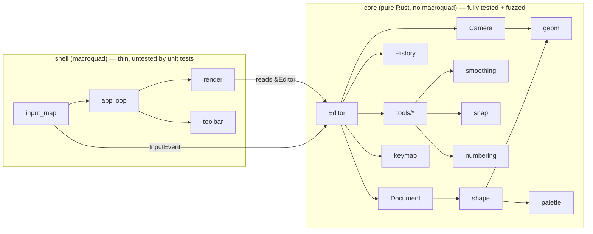

# Architecture

> This note describes the *current* architecture. Its history lives in the
> [[Decision Log]]; when an ADR changes something here, update this note in the
> same task and link the ADR.

## Shape of the program

- **core** knows nothing about windows, GPUs or macroquad. It consumes
  `InputEvent`s and exposes state. Everything here is unit-tested and fuzzed.
- **shell** translates macroquad input into `InputEvent`s, feeds the `Editor`,
  and draws its state. It contains no editing logic.

## Module map (owner task in parentheses)

| Module | Responsibility |
|--------|----------------|
| `core::geom` ([[T01 Geometry primitives]]) | `Vec2`, `Aabb`, distance to segment, finite-float helpers |
| `core::palette` ([[T02 Palette and theme tokens]]) | Fixed drawing colours + UI theme tokens |
| `core::camera` ([[T03 Camera]]) | World ↔ screen transform, pan, zoom-at-cursor, clamping |
| `core::smoothing` ([[T04 Stroke smoothing]]) | Anti-tremor: resample, EMA, Douglas–Peucker |
| `core::shape` ([[T05 Shape model]], grid + labels [[T16 Shape model v2 and helper skeleton]]) | `Shape` enum (incl. `Grid`, `Rect`/`Ellipse` labels), style, bounds, hit-test, inside-test, translate, `grid_lines` |
| `core::document`, `core::history` ([[T06 Document and history]]) | Ordered shape store with ids; transactional undo/redo |
| `core::input`, `core::command`, `core::editor`, `core::tools::{mod,navigate}` ([[T08 Editor core and input model]]) | Input model, command enum, editor state + dispatch, pan/zoom |
| `core::tools::{pen,shape_tool}` ([[T09 Creation tools]]) | Pen, rectangle, ellipse, line, arrow |
| `core::tools::{eraser,bucket,select}`, `core::clipboard` ([[T10 Editing tools]]) | Erase, fill, select/move, copy/paste/duplicate |
| `core::keymap` ([[T11 Keymap and macros]]) | Key chords → `Command` |
| `core::editor::Helpers` ([[T16 Shape model v2 and helper skeleton]]) | Snap flags, numbering counter, grid size; carried in `DrawStyle` ([[ADR-T16-3 Helper settings and hooks]]) |
| `core::snap` ([[T17 Snapping]]) | Snap dragged points: grid → size → align → round, alignment guides ([[ADR-T17-1 Snapping order and tolerances]]) |
| `core::tools::grid` ([[T18 Grid tool]]) | Grid tool: drag a box, `cols × rows` read live from `Helpers`, `Shift` = square cells ([[ADR-T18-1 Grid drag reads live dims and snaps as a box]]) |
| `core::numbering` ([[T19 Auto-numbering]]) | Labels for new rectangles/ellipses; counter rules for gesture end, undo and redo ([[ADR-T19-1 Numbering counter and undo]]) |
| `shell::render` ([[T07 Renderer]]) | Draw shapes (grids, labels) and previews through the camera; snap dot grid (`draw_underlay`) and alignment guides (`draw_guides`) |
| `shell::{app,input_map,toolbar}` ([[T12 App shell and toolbar]]) | Window, event loop, toolbar UI |
| `tests/fuzz.rs` ([[T13 Fuzz harness]]) | Random input-sequence fuzzing of `Editor` |

## Data flow per frame

The loop sleeps in miniquad's blocking event loop and wakes only on input or
resize ([[ADR-T12-1 Blocking event loop with cached frame]]). Per woken frame:

1. `shell::input_map::Collector` yields every raw event since the last frame,
   in order, as `InputEvent`s in logical screen pixels.
2. `shell::toolbar::route` sends presses on the visible toolbar to
   `Editor::apply(command)`; everything else goes to `Editor::handle(event)`.
   Both return whether anything changed.
3. The shell builds the document layer's key — `Editor::document_revision`,
   shape count, camera, framebuffer size, `overlay.hidden`, grid snap — and
   `shell::app::plan_redraw` compares it with the cached one
   ([[ADR-T24-1 Document layer keyed by a document revision]]):
   - only shapes added on top since the cached layer
     (`Editor::document_base_revision` ≤ cached revision, view unchanged)
     → draw just those onto the **document layer**
     ([[ADR-T24-3 Batched meshes and append-only document updates]]);
   - any other key change → re-render the document layer (background,
     underlay dot grid, shapes minus `overlay.hidden`);
   - otherwise → keep it.
   The document layer is a cached, 4× multisampled render target
   ([[ADR-0006 Redraw on demand]], [[ADR-T15-1 MSAA on the cached frame]]).
   `shell::render` tessellates shapes into a `Batch` submitted with
   `draw_mesh` in chunks. `DRAW_FRAME_TIMES=1` logs each re-render. More
   ideas: [[Rendering performance options]].
4. The document layer is blitted to the window (one quad) and the overlay —
   overlay shapes, guides, selection, marquee, toolbar — is drawn on top,
   single-sampled ([[ADR-T24-2 Overlay drawn straight to the window]]).

## Invariants (checked by the fuzzer)

- No panic for any input sequence, including NaN/∞/huge coordinates.
- All stored coordinates are finite.
- Undo all → empty document; redo all → identical document.
- Camera zoom stays within `[ZOOM_MIN, ZOOM_MAX]`.
- Selection only refers to shape ids that exist.
- Grid dimensions (of shapes and of the editor's settings) are in
  `1..=GRID_MAX_CELLS`; labels and the numbering counter are ≥ 1.
