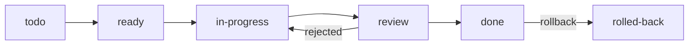

# Workflow — SDD + TDD

Every task follows **Spec-Driven Development** (the spec is written and agreed
before code) and **Test-Driven Development** (tests are written before the code
that makes them pass).

The project skill `.claude/skills/implement-task` encodes this workflow; the
coding rules come from `.claude/skills/rust-skills` (vendored from
[leonardomso/rust-skills](https://github.com/leonardomso/rust-skills), MIT).

## Lifecycle of a task

| Status | Meaning |
|--------|---------|
| `todo` | Planned; dependencies not finished |
| `ready` | All `depends_on` tasks are `done` — can be picked up |
| `in-progress` | Someone (human or agent) owns it on its branch |
| `review` | All subtasks committed, quality gates green, waiting for merge |
| `done` | Merged into `main` |
| `rolled-back` | Reverted explicitly (see [[Decision Protocol]]) |

## Steps (one commit per step — see [[Commit Convention]])

1. **Branch** — `git switch -c task/<ID>-<slug> main` (or a worktree, see [[Parallel Execution]]).
2. **Spec** (`docs`) — refine the task note's *Spec* section: every acceptance
   criterion `AC-n` names the test(s) that will prove it. Add ADRs for any new
   architecture choice. Set status `in-progress`.
3. **Tests** (`test`) — write tests for every `AC-n`. They are expected to fail
   (or not compile) — this commit is intentionally **red**.
4. **Models** (`feat`) — types, data structures and signatures. Bodies may be
   `todo!()`. Code compiles; behaviour tests still fail.
5. **Behaviour** (`feat`) — implement logic until all tests are **green**.
6. **Quality** (`refactor`/`chore`) — `scripts/check.sh` passes: fmt, clippy
   with `-D warnings`, tests, doc build. Refactor without changing behaviour.
7. **Docs** (`docs`) — feature note, tutorial note (learning path), task note
   status → `review`, ADR status updates.
8. **Integrate** (done by the integrator on `main`, see [[Parallel Execution]]) —
   `git merge --no-ff`, then update [[Task Board]], [[Decision Log]],
   [[Feature Index]], [[Learning Path]].
9. **Clear context** (integrator) — once the integration commit is on `main`,
   clear the session context (`/clear`) before starting the next task or wave.
   Everything needed to resume lives in the repo: [[Task Board]], task notes,
   ADRs and git history. If the context cannot be cleared right away, the
   integrator must remind the user to do it.

Steps may be skipped only if they produce nothing (e.g. a task with no new
models); the task note must then say *why* it was skipped.

## Rules

- `main` is always green. Red commits exist only on task branches (step 3–4).
- A task touches only the files listed under *Files owned* in its note.
  Needing another file means the plan is wrong: stop and amend the task note
  (and the owning task) first.
- Never edit an accepted ADR's decision — add a new ADR (see [[Decision Protocol]]).
- Every feature gets a note in `features/` and a tutorial in `tutorials/`
  placed in the [[Learning Path]].
