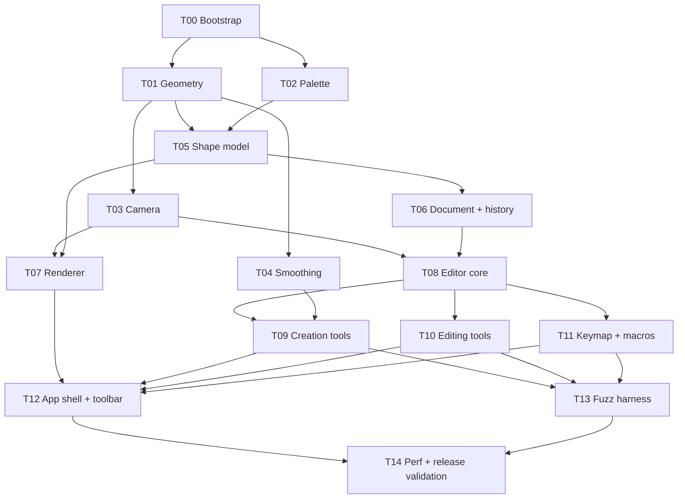

# Task Board

Status lives in each task note's frontmatter; this board is refreshed by the
integrator on `main` (see [[Parallel Execution]]).

## Dependency graph

## Waves (tasks in one wave run in parallel)

| Wave | Tasks |
|------|-------|
| 0 | [[T00 Bootstrap]] |
| 1 | [[T01 Geometry primitives]] · [[T02 Palette and theme tokens]] |
| 2 | [[T03 Camera]] · [[T04 Stroke smoothing]] · [[T05 Shape model]] |
| 3 | [[T06 Document and history]] · [[T07 Renderer]] |
| 4 | [[T08 Editor core and input model]] |
| 5 | [[T09 Creation tools]] · [[T10 Editing tools]] · [[T11 Keymap and macros]] |
| 6 | [[T12 App shell and toolbar]] · [[T13 Fuzz harness]] |
| 7 | [[T14 Performance and release validation]] |

## Status

| Task | Status | Depends on | Branch |
|------|--------|------------|--------|
| [[T00 Bootstrap]] | done | — | `task/T00-bootstrap` |
| [[T01 Geometry primitives]] | done | T00 | `task/T01-geometry` |
| [[T02 Palette and theme tokens]] | done | T00 | `task/T02-palette` |
| [[T03 Camera]] | done | T01 | `task/T03-camera` |
| [[T04 Stroke smoothing]] | done | T01 | `task/T04-smoothing` |
| [[T05 Shape model]] | done | T01, T02 | `task/T05-shape` |
| [[T06 Document and history]] | done | T05 | `task/T06-document` |
| [[T07 Renderer]] | done | T03, T05 | `task/T07-renderer` |
| [[T08 Editor core and input model]] | done | T03, T06 | `task/T08-editor` |
| [[T09 Creation tools]] | ready | T04, T08 | `task/T09-creation-tools` |
| [[T10 Editing tools]] | ready | T08 | `task/T10-editing-tools` |
| [[T11 Keymap and macros]] | ready | T08 | `task/T11-keymap` |
| [[T12 App shell and toolbar]] | todo | T07, T09, T10, T11 | `task/T12-app-shell` |
| [[T13 Fuzz harness]] | todo | T09, T10, T11 | `task/T13-fuzz` |
| [[T14 Performance and release validation]] | todo | T12, T13 | `task/T14-release` |
