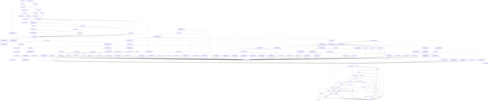

# Task Board

Status lives in each task note's frontmatter; this board is refreshed by the
integrator on `main` (see [[Parallel Execution]]).

## Dependency graph

```mermaid
flowchart TD
  T00[T00 Bootstrap] --> T01[T01 Geometry]
  T00 --> T02[T02 Palette]
  T01 --> T03[T03 Camera]
  T01 --> T04[T04 Smoothing]
  T01 --> T05[T05 Shape model]
  T02 --> T05
  T05 --> T06[T06 Document + history]
  T03 --> T07[T07 Renderer]
  T05 --> T07
  T03 --> T08[T08 Editor core]
  T06 --> T08
  T08 --> T09[T09 Creation tools]
  T04 --> T09
  T08 --> T10[T10 Editing tools]
  T08 --> T11[T11 Keymap + macros]
  T07 --> T12[T12 App shell + toolbar]
  T09 --> T12
  T10 --> T12
  T11 --> T12
  T09 --> T13[T13 Fuzz harness]
  T10 --> T13
  T11 --> T13
  T12 --> T14[T14 Perf + release validation]
  T13 --> T14
  T12 --> T15[T15 Anti-aliasing]
  T12 --> T16[T16 Shape model v2 + helper skeleton]
  T13 --> T16
  T16 --> T17[T17 Snapping]
  T16 --> T18[T18 Grid tool]
  T17 --> T19[T19 Auto-numbering]
  T17 --> T20[T20 Outline snapping]
  T15 --> T14
  T17 --> T14
  T18 --> T14
  T19 --> T14
  T20 --> T14
  T18 --> T21[T21 Cell fill + fill eraser]
  T21 --> T14
  T19 --> T22[T22 Numbering drives grid indices]
  T21 --> T22
  T22 --> T14
  T05 --> T23[T23 Arrow head proportional to width]
  T23 --> T14
  T14 --> T24[T24 Smooth redraws with large documents]
  T14 --> T25[T25 Linear-time selection with large documents]
  T24 --> T26[T26 Pan and zoom without re-rendering]
  T14 --> T27[T27 Linux packaging]
  T27 --> T28[T28 Experimental native Wayland backend]
  T14 --> T29[T29 Text blocks]
  T29 --> T32[T32 Fast text rendering]
  T32 --> T30[T30 Basic TeX formulas]
  T29 --> T30
  T29 --> T31[T31 Text in rectangles and grid cells]
  T30 --> T33[T33 Math font for formulas]
  T28 --> T34[T34 Pen tablet input]
  T34 --> T35[T35 Pen pressure and native Wayland tablets]
  T33 --> T36[T36 Integrals in formulas]
  T31 --> T37[T37 Remember the text size]
  T12 --> T38[T38 Left-hand tool keys]
  T36 --> T39[T39 Accents in formulas]
  T35 --> T40[T40 Pen pressure on native Wayland]
  T36 --> T41[T41 Integral superscript at the advance]
  T35 --> T42[T42 Join pen tip bounces]
  T43[T43 Adopt clippy 1.99 lints]
  T28 --> T44[T44 One keyboard per Wayland seat]
  T44 --> T45[T45 Doubled keys after a long idle on Wayland]
  T45 --> T46[T46 Native Wayland by default and Xwayland deprecated]
  T47[T47 Always-on diagnostics log] --> T48[T48 Clean exit on Ctrl-C]
  T47 --> T49[T49 Long-running stability]
  T51[T51 Build-time themes]
  T52[T52 Text in shapes by default]
  T46 --> T53[T53 Release 1.5.0]
  T47 --> T53
  T48 --> T53
  T49 --> T53
  T51 --> T53
  T52 --> T53
  T54[T54 Math alphabet styles]
  T54 --> T53
  T54 --> T55[T55 Math font subset for alphabets and symbols]
  T55 --> T53
  T54 --> T56[T56 Bold math]
  T55 --> T56[T56 Bold math]
  T56 --> T53
  T54 --> T57[T57 Blackboard bold]
  T55 --> T57[T57 Blackboard bold]
  T57 --> T53
  T54 --> T58[T58 Fraktur letters]
  T55 --> T58[T58 Fraktur letters]
  T58 --> T53
  T54 --> T59[T59 Script letters]
  T55 --> T59[T59 Script letters]
  T59 --> T53
  T54 --> T60[T60 Sans-serif and typewriter letters]
  T55 --> T60[T60 Sans-serif and typewriter letters]
  T60 --> T53
  T61[T61 Hebrew letters]
  T61 --> T53
  T54 --> T62[T62 Complete Greek letters]
  T62 --> T53
  T63[T63 Trigonometric and hyperbolic functions]
  T63 --> T53
  T63 --> T64[T64 Named operators with limits]
  T64 --> T53
  T55 --> T65[T65 Set and logic symbols]
  T65 --> T53
  T55 --> T66[T66 Big set and logic operators]
  T65 --> T66[T66 Big set and logic operators]
  T66 --> T53
  T55 --> T67[T67 Algebra and group theory symbols]
  T64 --> T67[T67 Algebra and group theory symbols]
  T67 --> T53
  T55 --> T68[T68 Category theory symbols]
  T67 --> T68[T68 Category theory symbols]
  T68 --> T53
  T55 --> T69[T69 Classical physics notation]
  T56 --> T69[T69 Classical physics notation]
  T69 --> T53
  T69 --> T70[T70 Quantum notation]
  T70 --> T53
  T55 --> T71[T71 Combinatorics notation]
  T71 --> T53
  T72[T72 Feature proposal]
  T72 --> T53
  T73[T73 Continuous integration on GitHub]
  T73 --> T53
  T74[T74 Editor snapshots for tests]
  T74 --> T53
  T73 --> T75[T75 End-to-end test suite]
  T74 --> T75
  T75 --> T53
  T74 --> T76[T76 Remembered text size past the ladder]
  T76 --> T53
  T77[T77 Test sessions that leave the machine usable] --> T53
  T74 --> T78[T78 Formula ink outside its text box]
  T78 --> T53
  T75 --> T79[T79 Wayland keyboard without a keymap]
  T79 --> T53
  T75 --> T80[T80 Mouse cursor in end-to-end screenshots]
  T80 --> T53
  T74 --> T81[T81 Formula box too narrow while editing]
  T81 --> T53
  T82[T82 Raise the binary size limit]
  T82 --> T53
  T83[T83 Paste text from the clipboard]
  T83 --> T53
  T83 --> T84[T84 Grid from text]
  T84 --> T53
  T85[T85 Resize a committed grid]
  T85 --> T53
  T86[T86 Zero-based numbering]
  T86 --> T53
  T84 --> T87[T87 Graph or tree from an edge list]
  T87 --> T53
  T88[T88 Bucket drag across cells]
  T88 --> T53
  T89[T89 Growing brackets]
  T89 --> T53
  T89 --> T90[T90 Matrices and cases]
  T90 --> T53
  T91[T91 Resize handles]
  T91 --> T53
  T92[T92 Export the view to PNG]
  T92 --> T53
  T87 --> T93[T93 Coordinate plane from points]
  T93 --> T53
  T94[T94 Autosave and crash recovery]
  T94 --> T53
  T93 --> T95[T95 Labels on plotted points]
  T95 --> T53
  T87 --> T96[T96 Keywords for graph input]
  T96 --> T97[T97 Spaced edge pairs]
  T97 --> T98[T98 Math names and weights in graphs]
  T98 --> T53
  T99[T99 Spacing commands]
  T99 --> T103[T103 Labelled extensible arrows]
  T100[T100 Z-order keys]
  T100 --> T101[T101 Align and distribute]
  T98 --> T102[T102 Graph input follow-ups]
  T102 --> T104[T104 Segment tree drawing]
  T99 --> T53
  T100 --> T53
  T101 --> T53
  T102 --> T53
  T103 --> T53
  T104 --> T53
  T105[T105 Display mode]
  T105 --> T53
  T106[T106 Fading laser pointer]
  T106 --> T53
  T107[T107 Lock shapes]
  T107 --> T108[T108 Save and load]
  T109[T109 Shape recognition]
  T110[T110 Minimap]
  T111[T111 Command palette]
  T111 --> T113[T113 Shortcut sheet]
  T105 --> T112[T112 User macros]
  T107 --> T53
  T108 --> T53
  T109 --> T53
  T110 --> T53
  T111 --> T53
  T112 --> T53
  T113 --> T53
  T114[T114 Export to SVG]
  T115[T115 Copy the selection as an image]
  T116[T116 Pages]
  T116 --> T108
  T114 --> T53
  T115 --> T53
  T116 --> T53
  T117[T117 Looser shape recognition] --> T118[T118 Release 1.6.0]
  T119[T119 Forest layout in layers] --> T118
  T120[T120 Weight label on diagonal edges] --> T118
  T121[T121 Self-loops and opposite edges in graphs] --> T118
  T122[T122 ASCII text in the palette and the sheet] --> T123[T123 Menu font]
  T123 --> T124[T124 Page switcher in the toolbar]
  T116 --> T124
  T122 --> T118
  T123 --> T118
  T124 --> T118
  T125[T125 Six pages, one per row] --> T118
  T123 --> T126[T126 Menu islands]
  T125 --> T126
  T124 --> T125
  T53 --> T118
  T108 --> T118
  T112 --> T118
  T113 --> T118
  T114 --> T118
  T115 --> T118
  T116 --> T118
  T118 --> T50[T50 Version 2.0.0 refactor]
  T118 --> T127
  T127 --> T128
  T127 --> T129
  T127 --> T130
  T127 --> T131
  T131 --> T132
  T132 --> T133
  T132 --> T134
  T133 --> T135
  T134 --> T135
  T133 --> T136
  T134 --> T136
  T133 --> T137
  T134 --> T137
  T135 --> T138
  T136 --> T138
  T137 --> T138
  T132 --> T139
  T132 --> T140
  T137 --> T140
  T140 --> T141
  T132 --> T142
  T140 --> T142
  T142 --> T143
  T145 --> T143
  T142 --> T144
  T145 --> T144
  T142 --> T145
  T135 --> T146
  T136 --> T146
  T153 --> T146
  T145 --> T146
  T143 --> T147
  T144 --> T147
  T146 --> T147
  T146 --> T148
  T143 --> T149
  T144 --> T149
  T146 --> T149
  T147 --> T149
  T148 --> T149
  T152 --> T149
  T149 --> T150
  T127 --> T151
  T128 --> T151
  T129 --> T151
  T130 --> T151
  T131 --> T151
  T132 --> T151
  T133 --> T151
  T134 --> T151
  T135 --> T151
  T136 --> T151
  T137 --> T151
  T138 --> T151
  T139 --> T151
  T140 --> T151
  T141 --> T151
  T142 --> T151
  T143 --> T151
  T144 --> T151
  T145 --> T151
  T146 --> T151
  T147 --> T151
  T148 --> T151
  T149 --> T151
  T152 --> T151
  T153 --> T151
  T136 --> T153
  T138 --> T153
  T152 --> T154
  T129 --> T154
  T154 --> T149
  T154 --> T151
  T127 --> T152
  T128 --> T152
```

## Waves (tasks in one wave run in parallel)

| Wave | Tasks |
|------|-------|
| 0 | [[T00 Bootstrap]] |
| 1 | [[T01 Geometry primitives]] · [[T02 Palette and theme tokens]] |
| 2 | [[T03 Camera]] · [[T04 Stroke smoothing]] · [[T05 Shape model]] |
| 3 | [[T06 Document and history]] · [[T07 Renderer]] |
| 4 | [[T08 Editor core and input model]] |
| 5 | [[T09 Creation tools]] · [[T10 Editing tools]] · [[T11 Keymap and macros]] |
| 6 | [[T12 App shell and toolbar]] · [[T13 Fuzz harness]] |
| 7 | [[T15 Anti-aliasing]] · [[T16 Shape model v2 and helper skeleton]] |
| 8 | [[T17 Snapping]] · [[T18 Grid tool]] |
| 9 | [[T19 Auto-numbering]] · [[T20 Outline snapping]] |
| 10 | [[T21 Cell fill and fill eraser]] |
| 11 | [[T22 Numbering drives grid indices]] · [[T23 Arrow head proportional to width]] |
| 12 | [[T14 Performance and release validation]] |
| 13 | [[T24 Smooth redraws with large documents]] · [[T25 Linear-time selection with large documents]] |
| 14 | [[T26 Pan and zoom without re-rendering]] |
| 15 | [[T29 Text blocks]] |
| 16 | [[T32 Fast text rendering]] |
| 17 | [[T30 Basic TeX formulas]] |
| 18 | [[T33 Math font for formulas]] |
| 19 | [[T31 Text in rectangles and grid cells]] |
| 20 | [[T27 Linux packaging]] |
| 21 | [[T28 Experimental native Wayland backend]] |
| 22 | [[T34 Pen tablet input]] |
| 23 | [[T35 Pen pressure and native Wayland tablets]] |
| 24 | [[T36 Integrals in formulas]] · [[T37 Remember the text size]] · [[T38 Left-hand tool keys]] |
| 25 | [[T39 Accents in formulas]] |
| 26 | [[T40 Pen pressure on native Wayland]] |
| 27 | [[T41 Integral superscript at the advance]] |
| 28 | [[T42 Join pen tip bounces]] · [[T43 Adopt clippy 1.99 lints]] |
| 29 | [[T44 One keyboard per Wayland seat]] |
| 30 | [[T45 Doubled keys after a long idle on Wayland]] |
| 31 | [[T46 Native Wayland by default and Xwayland deprecated]] · [[T47 Always-on diagnostics log]] |
| 32 | [[T48 Clean exit on Ctrl-C]] · [[T49 Long-running stability]] · [[T51 Build-time themes]] · [[T52 Text in shapes by default]] |
| 33 | [[T54 Math alphabet styles]] · [[T72 Feature proposal]] · [[T73 Continuous integration on GitHub]] · [[T74 Editor snapshots for tests]] · [[T77 Test sessions that leave the machine usable]] |
| 34 | [[T55 Math font subset for alphabets and symbols]] · [[T75 End-to-end test suite]] · [[T76 Remembered text size past the ladder]] · [[T78 Formula ink outside its text box]] · [[T81 Formula box too narrow while editing]] |
| 35 | [[T56 Bold math]] · [[T79 Wayland keyboard without a keymap]] · [[T80 Mouse cursor in end-to-end screenshots]] |
| 36 | [[T57 Blackboard bold]] |
| 37 | [[T58 Fraktur letters]] |
| 38 | [[T59 Script letters]] |
| 39 | [[T60 Sans-serif and typewriter letters]] |
| 40 | [[T61 Hebrew letters]] |
| 41 | [[T62 Complete Greek letters]] |
| 42 | [[T63 Trigonometric and hyperbolic functions]] |
| 43 | [[T64 Named operators with limits]] |
| 44 | [[T65 Set and logic symbols]] |
| 45 | [[T66 Big set and logic operators]] |
| 46 | [[T67 Algebra and group theory symbols]] |
| 47 | [[T68 Category theory symbols]] |
| 48 | [[T69 Classical physics notation]] |
| 49 | [[T70 Quantum notation]] |
| 50 | [[T71 Combinatorics notation]] |
| 51 | [[T82 Raise the binary size limit]] · [[T83 Paste text from the clipboard]] · [[T85 Resize a committed grid]] · [[T86 Zero-based numbering]] · [[T88 Bucket drag across cells]] · [[T89 Growing brackets]] · [[T91 Resize handles]] · [[T92 Export the view to PNG]] · [[T94 Autosave and crash recovery]] |
| 52 | [[T84 Grid from text]] · [[T90 Matrices and cases]] |
| 53 | [[T87 Graph or tree from an edge list]] |
| 54 | [[T93 Coordinate plane from points]] · [[T96 Keywords for graph input]] |
| 55 | [[T95 Labels on plotted points]] · [[T97 Spaced edge pairs]] |
| 56 | [[T98 Math names and weights in graphs]] |
| 57 | [[T99 Spacing commands]] · [[T100 Z-order keys]] · [[T102 Graph input follow-ups]] |
| 58 | [[T101 Align and distribute]] · [[T103 Labelled extensible arrows]] · [[T104 Segment tree drawing]] |
| 59 | [[T105 Display mode]] · [[T106 Fading laser pointer]] · [[T107 Lock shapes]] · [[T109 Shape recognition]] · [[T110 Minimap]] · [[T111 Command palette]] · [[T114 Export to SVG]] · [[T115 Copy the selection as an image]] · [[T116 Pages]] |
| 60 | [[T108 Save and load]] · [[T112 User macros]] · [[T113 Shortcut sheet]] · [[T117 Looser shape recognition]] · [[T119 Forest layout in layers]] · [[T120 Weight label on diagonal edges]] · [[T121 Self-loops and opposite edges in graphs]] · [[T122 ASCII text in the palette and the sheet]] · [[T123 Menu font]] · [[T124 Page switcher in the toolbar]] · [[T125 Six pages, one per row]] |
| 61 | [[T53 Release 1.5.0]] |
| 62 | [[T118 Release 1.6.0]] · [[T126 Menu islands]] |
| 63 | [[T50 Version 2.0.0 refactor]] |
| 64 | [[T127 2.0 audit and baseline]] |
| 65 | [[T128 Keep X11 and revert the deprecation]] · [[T129 Release gate with end-to-end on X11 and Wayland]] · [[T130 Coverage in CI with a ratchet]] · [[T131 No dynamic dispatch and stricter lints]] · [[T132 Workspace split with unsafe levels]] |
| 66 | [[T133 Typed units and ids]] · [[T134 The control automaton states, inputs and effects]] · [[T139 Split tex.rs into modules]] |
| 67 | [[T135 Automaton modal states, pages, camera and selection]] · [[T136 Automaton gestures and text editing per tool]] · [[T137 Automaton effects queue and time as an input]] |
| 68 | [[T138 Model-based tests of the automaton]] · [[T140 Platform and Gpu traits with recording interpreters]] · [[T141 Fuzz of the shell through the recording platform]] |
| 69 | [[T142 draw-sys foundation with dlopen, safe wrappers and the unsafe test set]] · [[T145 OpenGL ES 3.0 context and loader (EGL and GLX)]] · [[T153 Text and select as sub-automata]] |
| 70 | [[T143 Wayland backend with window, keyboard, pointer, tablet and clipboard]] · [[T144 X11 backend with window, keyboard, pointer, XInput2 pressure and selections]] |
| 71 | [[T146 Retained renderer in draw-gfx]] · [[T147 Frame pacing by the compositor and idle at zero]] |
| 72 | [[T148 Multithreaded tessellation, only with a measured gain]] · [[T152 Command line and DRAW_* variables audit]] · [[T154 Environment variables to flags]] |
| 73 | [[T149 Cutover removing miniquad and macroquad]] |
| 74 | [[T150 Optional Vulkan backend for the Gpu trait]] · [[T151 Release 2.0.0]] |

## Status

| Task | Status | Depends on | Branch |
|------|--------|------------|--------|
| [[T00 Bootstrap]] | done | — | `task/T00-bootstrap` |
| [[T01 Geometry primitives]] | done | T00 | `task/T01-geometry` |
| [[T02 Palette and theme tokens]] | done | T00 | `task/T02-palette` |
| [[T03 Camera]] | done | T01 | `task/T03-camera` |
| [[T04 Stroke smoothing]] | done | T01 | `task/T04-smoothing` |
| [[T05 Shape model]] | done | T01, T02 | `task/T05-shape` |
| [[T06 Document and history]] | done | T05 | `task/T06-document` |
| [[T07 Renderer]] | done | T03, T05 | `task/T07-renderer` |
| [[T08 Editor core and input model]] | done | T03, T06 | `task/T08-editor` |
| [[T09 Creation tools]] | done | T04, T08 | `task/T09-creation-tools` |
| [[T10 Editing tools]] | done | T08 | `task/T10-editing-tools` |
| [[T11 Keymap and macros]] | done | T08 | `task/T11-keymap` |
| [[T12 App shell and toolbar]] | done | T07, T09, T10, T11 | `task/T12-app-shell` |
| [[T13 Fuzz harness]] | done | T09, T10, T11 | `task/T13-fuzz` |
| [[T15 Anti-aliasing]] | done | T12 | `task/T15-antialiasing` |
| [[T16 Shape model v2 and helper skeleton]] | done | T12, T13 | `task/T16-helper-skeleton` |
| [[T17 Snapping]] | done | T16 | `task/T17-snapping` |
| [[T18 Grid tool]] | done | T16 | `task/T18-grid-tool` |
| [[T19 Auto-numbering]] | done | T16, T17 | `task/T19-numbering` |
| [[T20 Outline snapping]] | done | T17 | `task/T20-outline-snapping` |
| [[T21 Cell fill and fill eraser]] | done | T18 | `task/T21-cell-fill` |
| [[T22 Numbering drives grid indices]] | done | T18, T19, T21 | `task/T22-numbered-grids` |
| [[T23 Arrow head proportional to width]] | done | T05 | `fix/arrow-head-scale` |
| [[T14 Performance and release validation]] | done | T12, T13, T15–T23 | `task/T14-release` |
| [[T24 Smooth redraws with large documents]] | done | T14 | `task/T24-layered-redraw` |
| [[T25 Linear-time selection with large documents]] | done | T14 | `task/T25-fast-lookup` |
| [[T26 Pan and zoom without re-rendering]] | done | T24 | `task/T26-gesture-redraw` |
| [[T29 Text blocks]] | done | T14 | `task/T29-text` |
| [[T32 Fast text rendering]] | done | T29 | `task/T32-fast-text` |
| [[T30 Basic TeX formulas]] | done | T29, T32 | `task/T30-tex` |
| [[T33 Math font for formulas]] | done | T30 | `task/T33-math-font` |
| [[T31 Text in rectangles and grid cells]] | done | T29 | `task/T31-shape-text` |
| [[T27 Linux packaging]] | done | T14 | `task/T27-packaging` |
| [[T28 Experimental native Wayland backend]] | done | T27 | `task/T28-wayland` |
| [[T34 Pen tablet input]] | done | T28 | `task/T34-pen-tablet` |
| [[T35 Pen pressure and native Wayland tablets]] | done | T34 | `task/T35-pen-pressure` |
| [[T36 Integrals in formulas]] | done | T33 | `task/T36-integrals` |
| [[T37 Remember the text size]] | done | T29, T31 | `task/T37-text-size-memory` |
| [[T38 Left-hand tool keys]] | done | T11, T12 | `task/T38-left-hand-keys` |
| [[T39 Accents in formulas]] | done | T36 | `task/T39-accents` |
| [[T40 Pen pressure on native Wayland]] | done | T35 | `fix/wayland-pen-pressure` |
| [[T41 Integral superscript at the advance]] | done | T36 | `fix/integral-superscript` |
| [[T42 Join pen tip bounces]] | done | T35 | `fix/pen-tip-bounce` |
| [[T43 Adopt clippy 1.99 lints]] | done | — | `chore/clippy-1-99` |
| [[T44 One keyboard per Wayland seat]] | done | T28 | `fix/wayland-seat-devices` |
| [[T45 Doubled keys after a long idle on Wayland]] | done | T44 | `fix/wayland-idle-doubled-keys` |
| [[T46 Native Wayland by default and Xwayland deprecated]] | done | T28, T44, T45 | `task/T46-wayland-default` |
| [[T47 Always-on diagnostics log]] | done | — | `task/T47-diagnostics-log` |
| [[T48 Clean exit on Ctrl-C]] | done | T47 | `fix/clean-exit-on-sigint` |
| [[T49 Long-running stability]] | done | T47 | `fix/long-running-stability` |
| [[T51 Build-time themes]] | done | — | `task/T51-build-time-themes` |
| [[T52 Text in shapes by default]] | done | — | `task/T52-shape-text-default` |
| [[T54 Math alphabet styles]] | done | — | `task/T54-math-alphabets` |
| [[T55 Math font subset for alphabets and symbols]] | done | T54 | `task/T55-math-font-subset` |
| [[T56 Bold math]] | done | T54, T55 | `task/T56-bold-math` |
| [[T57 Blackboard bold]] | done | T54, T55 | `task/T57-blackboard-bold` |
| [[T58 Fraktur letters]] | done | T54, T55 | `task/T58-fraktur` |
| [[T59 Script letters]] | done | T54, T55 | `task/T59-script-letters` |
| [[T60 Sans-serif and typewriter letters]] | done | T54, T55 | `task/T60-sans-and-mono` |
| [[T61 Hebrew letters]] | done | — | `task/T61-hebrew-letters` |
| [[T62 Complete Greek letters]] | done | T54 | `task/T62-complete-greek` |
| [[T63 Trigonometric and hyperbolic functions]] | done | — | `task/T63-trig-functions` |
| [[T64 Named operators with limits]] | done | T63 | `task/T64-named-operators` |
| [[T65 Set and logic symbols]] | done | T55 | `task/T65-set-logic-symbols` |
| [[T66 Big set and logic operators]] | done | T55, T65 | `task/T66-big-operators` |
| [[T67 Algebra and group theory symbols]] | done | T55, T64 | `task/T67-algebra-symbols` |
| [[T68 Category theory symbols]] | done | T55, T67 | `task/T68-category-symbols` |
| [[T69 Classical physics notation]] | done | T55, T56 | `task/T69-classical-physics` |
| [[T70 Quantum notation]] | done | T69 | `task/T70-quantum-notation` |
| [[T71 Combinatorics notation]] | done | T55 | `task/T71-combinatorics` |
| [[T72 Feature proposal]] | done | — | `docs/T72-feature-proposal` |
| [[T73 Continuous integration on GitHub]] | done | — | `task/T73-github-ci` |
| [[T74 Editor snapshots for tests]] | done | — | `task/T74-editor-snapshots` |
| [[T75 End-to-end test suite]] | done | T73, T74 | `task/T75-e2e-tests` |
| [[T76 Remembered text size past the ladder]] | done | T74 | `fix/remembered-text-size` |
| [[T77 Test sessions that leave the machine usable]] | done | — | `task/T77-gate-resource-limits` |
| [[T78 Formula ink outside its text box]] | done | T74 | `fix/formula-ink-outside-box` |
| [[T79 Wayland keyboard without a keymap]] | done | T75 | `fix/wayland-no-keymap` |
| [[T80 Mouse cursor in end-to-end screenshots]] | done | T75 | `fix/e2e-cursor-in-screenshots` |
| [[T81 Formula box too narrow while editing]] | done | T74 | `fix/formula-box-while-editing` |
| [[T82 Raise the binary size limit]] | done | — | `chore/T82-binary-limit` |
| [[T83 Paste text from the clipboard]] | done | — | `task/T83-paste-text` |
| [[T84 Grid from text]] | done | T83 | `task/T84-grid-from-text` |
| [[T85 Resize a committed grid]] | done | — | `task/T85-resize-grid` |
| [[T86 Zero-based numbering]] | done | — | `task/T86-zero-based` |
| [[T87 Graph or tree from an edge list]] | done | T84 | `task/T87-graph-from-edges` |
| [[T88 Bucket drag across cells]] | done | — | `task/T88-bucket-drag` |
| [[T89 Growing brackets]] | done | — | `task/T89-growing-brackets` |
| [[T90 Matrices and cases]] | done | T89 | `task/T90-matrices` |
| [[T91 Resize handles]] | done | — | `task/T91-resize-handles` |
| [[T92 Export the view to PNG]] | done | — | `task/T92-png-export` |
| [[T93 Coordinate plane from points]] | done | T87 | `task/T93-coordinate-plane` |
| [[T94 Autosave and crash recovery]] | done | — | `task/T94-autosave` |
| [[T95 Labels on plotted points]] | done | T93 | `task/T95-point-labels` |
| [[T96 Keywords for graph input]] | done | T87 | `task/T96-graph-keywords` |
| [[T97 Spaced edge pairs]] | done | T96 | `task/T97-spaced-edge-pairs` |
| [[T98 Math names and weights in graphs]] | done | T97 | `task/T98-math-graph-labels` |
| [[T99 Spacing commands]] | done | — | `task/T99-spacing-commands` |
| [[T100 Z-order keys]] | done | — | `task/T100-z-order-keys` |
| [[T101 Align and distribute]] | done | T100 | `task/T101-align-distribute` |
| [[T102 Graph input follow-ups]] | done | — | `task/T102-graph-input-follow-ups` |
| [[T103 Labelled extensible arrows]] | done | T99 | `task/T103-labelled-arrows` |
| [[T104 Segment tree drawing]] | done | T102 | `task/T104-segment-tree` |
| [[T105 Display mode]] | done | — | `task/T105-display-mode` |
| [[T106 Fading laser pointer]] | done | — | `task/T106-laser-pointer` |
| [[T107 Lock shapes]] | done | — | `task/T107-lock` |
| [[T108 Save and load]] | done | T107, T116 | `task/T108-save-and-load` |
| [[T109 Shape recognition]] | done | — | `task/T109-shape-recognition` |
| [[T110 Minimap]] | done | — | `task/T110-minimap` |
| [[T111 Command palette]] | done | — | `task/T111-command-palette` |
| [[T112 User macros]] | done | T105 | `task/T112-user-macros` |
| [[T113 Shortcut sheet]] | done | T111 | `task/T113-shortcut-sheet` |
| [[T114 Export to SVG]] | done | — | `task/T114-svg-export` |
| [[T115 Copy the selection as an image]] | done | — | `task/T115-copy-as-image` |
| [[T116 Pages]] | done | — | `task/T116-pages` |
| [[T53 Release 1.5.0]] | done | T46–T49, T51, T52, T54–T107, T109–T111 | `chore/release-1.5.0` |
| [[T117 Looser shape recognition]] | done | — | `task/T117-looser-recognition` |
| [[T119 Forest layout in layers]] | done | — | `task/T119-forest-layers` |
| [[T120 Weight label on diagonal edges]] | done | — | `fix/weight-label-tie` |
| [[T121 Self-loops and opposite edges in graphs]] | done | — | `fix/graph-loops-and-lanes` |
| [[T122 ASCII text in the palette and the sheet]] | done | — | `fix/ui-text-ascii` |
| [[T123 Menu font]] | done | T122 | `task/T123-menu-font` |
| [[T124 Page switcher in the toolbar]] | done | T116, T123 | `task/T124-page-switcher` |
| [[T125 Six pages, one per row]] | done | T124 | `fix/six-pages` |
| [[T126 Menu islands]] | done | T123, T125 | `task/T126-menu-islands` |
| [[T118 Release 1.6.0]] | done | T53, T108, T112–T117, T119–T125 | `chore/release-1.6.0` |
| [[T50 Version 2.0.0 refactor]] | in-progress | T46–T49, T51–T72, T118, T127–T154 | `task/T50-v2-refactor` |
| [[T127 2.0 audit and baseline]] | done | T118 | `task/T127-2-0-audit-and-baseline` |
| [[T128 Keep X11 and revert the deprecation]] | done | T127 | `task/T128-keep-x11-revert-the-deprecation` |
| [[T129 Release gate with end-to-end on X11 and Wayland]] | done | T127 | `task/T129-release-gate-with-end-to-end-on-x11-and-` |
| [[T130 Coverage in CI with a ratchet]] | done | T127 | `task/T130-coverage-in-ci-with-a-ratchet` |
| [[T131 No dynamic dispatch and stricter lints]] | done | T127 | `task/T131-no-dynamic-dispatch-and-stricter-lints` |
| [[T132 Workspace split with unsafe levels]] | done | T131 | `task/T132-workspace-split-with-unsafe-levels` |
| [[T133 Typed units and ids]] | done | T132 | `task/T133-typed-units-and-ids` |
| [[T134 The control automaton states, inputs and effects]] | done | T132 | `task/T134-the-control-automaton-states-inputs-effe` |
| [[T135 Automaton modal states, pages, camera and selection]] | done | T133, T134 | `task/T135-automaton-modal-states-pages-camera-and-` |
| [[T136 Automaton gestures and text editing per tool]] | done | T133, T134 | `task/T136-automaton-gestures-and-text-editing-per-` |
| [[T137 Automaton effects queue and time as an input]] | done | T133, T134 | `task/T137-automaton-effects-queue-and-time-as-an-i` |
| [[T138 Model-based tests of the automaton]] | done | T135, T136, T137 | `task/T138-model-based-tests-of-the-automaton` |
| [[T139 Split tex.rs into modules]] | done | T132 | `task/T139-split-tex-rs-into-modules` |
| [[T140 Platform and Gpu traits with recording interpreters]] | todo | T132, T137 | `task/T140-platform-and-gpu-traits-with-recording-i` |
| [[T141 Fuzz of the shell through the recording platform]] | todo | T140 | `task/T141-fuzz-of-the-shell-through-the-recording-` |
| [[T142 draw-sys foundation with dlopen, safe wrappers and the unsafe test set]] | todo | T132, T140 | `task/T142-draw-sys-foundation-dlopen-safe-wrappers` |
| [[T143 Wayland backend with window, keyboard, pointer, tablet and clipboard]] | todo | T142, T145 | `task/T143-wayland-backend-window-keyboard-pointer-` |
| [[T144 X11 backend with window, keyboard, pointer, XInput2 pressure and selections]] | todo | T142, T145 | `task/T144-x11-backend-window-keyboard-pointer-xinp` |
| [[T145 OpenGL ES 3.0 context and loader (EGL and GLX)]] | todo | T142 | `task/T145-opengl-es-3-0-context-and-loader-egl-and` |
| [[T146 Retained renderer in draw-gfx]] | todo | T145, T135, T136, T153 | `task/T146-retained-renderer-in-draw-gfx` |
| [[T147 Frame pacing by the compositor and idle at zero]] | todo | T143, T144, T146 | `task/T147-frame-pacing-by-the-compositor-and-idle-` |
| [[T148 Multithreaded tessellation, only with a measured gain]] | todo | T146 | `task/T148-multithreaded-tessellation-only-with-a-m` |
| [[T149 Cutover removing miniquad and macroquad]] | todo | T127–T149, T152, T153, T154 | `task/T149-cutover-remove-miniquad-and-macroquad` |
| [[T150 Optional Vulkan backend for the Gpu trait]] | todo (optional) | T149 | `task/T150-optional-vulkan-backend-for-the-gpu-trai` |
| [[T151 Release 2.0.0]] | todo | T127–T149, T152, T153, T154 | `task/T151-release-2-0-0` |
| [[T152 Command line and DRAW_* variables audit]] | done | T128, T127 | `task/T152-command-line-and-draw-variables-audit` |
| [[T153 Text and select as sub-automata]] | todo | T136, T138 | `task/T153-text-and-select-as-sub-automata` |
| [[T154 Environment variables to flags]] | todo | T152, T129 | `task/T154-environment-variables-to-flags` |
