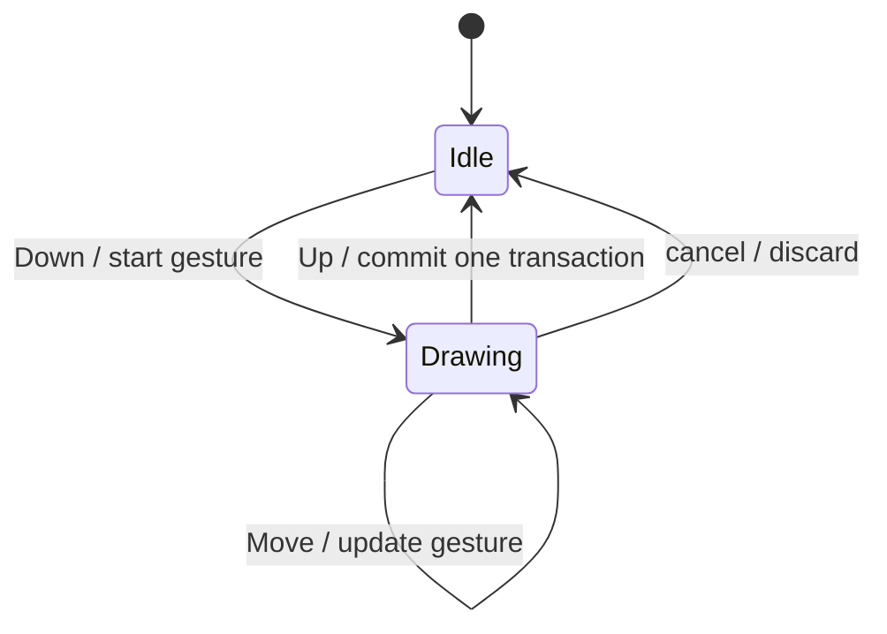

# Building drawing tools

> **Learning path step 9.** Requires: [[04 Taming shaky input]],
> [[08 An editor as an input-driven state machine]] · Next: [[10 Selection, clipboard and fill]]

## Why this matters here

The editor (step 8) turns raw input into `Pointer { phase, pos, mods }` events
and routes them to the active tool. A tool is where a gesture becomes a shape:
it must show feedback while the button is held, produce exactly one undo step
when it ends, and leave no trace if the gesture is cancelled.

## The concept

A drawing tool is a tiny state machine with two states:



The key rule is **nothing touches the document while Drawing**. The shape in
progress lives in the tool's own state and is shown as an *overlay*. Only the
`Up` transition creates a `Transaction`, so undo removes the whole gesture in
one step, and cancelling is simply "forget the state".

Two smaller ideas:

- **Sample the scale once.** Screen pixels become world units through the
  camera. The width and smoothing distances are chosen in pixels and
  converted on `Down` (`width = width_px / zoom`), so the line feels the same
  size at every zoom.
- **Constraints are pure functions of the drag.** Holding `Shift` does not
  change the stored drag; it changes how the shape is *derived* from it. A
  square keeps the drag's signs and uses `max(|dx|, |dy|)` as its side; a
  45° line projects the drag vector onto the nearest of the eight directions:

  ```
  θ  = round(atan2(dy, dx) / 45°) · 45°
  b' = a + dir(θ) · max(0, (b − a) · dir(θ))
  ```

## How draw implements it

- `pen::State { stroke: Option<LiveStroke> }` — `None` is Idle. `begin` builds
  a `Smoother` from `ctx.smoothing.params()` and `ctx.camera.world_len(1.0)`.
  `on_pointer` pushes `camera.screen_to_world(pos)` on every phase; on `Up` it
  `take()`s the stroke, calls `Smoother::finish` (which guarantees a dot for a
  click) and commits `tx_insert(doc, [stroke])` via `ToolCtx::commit`.
- `shape_tool::State { drag: Option<Drag> }` — `Kind::from_tool` maps
  `Tool::Line/Arrow/Rect/Ellipse`; any other tool is ignored. `Drag::shape`
  is used both by `preview` and by the commit, so what you see is what you
  get. `Up` rejects drags with
  `camera.screen_len(|b − a|) < MIN_DRAG_PX` — measured on screen, so a
  stray click is ignored at any zoom.
- `cancel` in both modules is `state.….take().is_some()`: the editor calls it
  on `Esc` and on tool switch, and its return value says whether to redraw.

## Try it

1. Change `MIN_DRAG_PX` to `10.0` and run `cargo test shape_tool`: which test
   fails, and why is a threshold in *screen* pixels the right unit?
2. Add a test `shift_constrains_line_vertical` dragging `(0, 0) → (3, 100)`
   with `Shift`, and assert the end is `(0, ≈100)`.
3. In `pen::on_pointer`, commit on every `Move` instead of on `Up`, then run
   `one_gesture_one_undo` and see what the test protects.

## Further reading

- [[ADR-T08-1 Tool context and gesture overlay]] — the tool API.
- [[ADR-0007 Anti-tremor pipeline]] — the smoother the pen drives.
- [[ADR-0013 World-space widths and zoom limits]] — why widths are world units.
