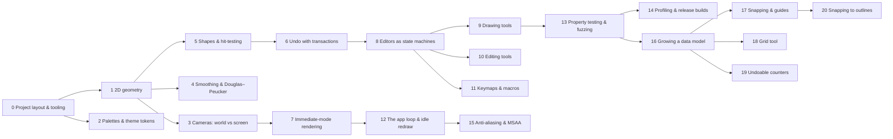

# Learning Path

The tutorials, read in order, teach how to build `draw` from scratch. Each task
writes its tutorial (template: `templates/Tutorial.md`) and states which steps
it requires. Planned order follows the task chain:

| Step | Tutorial | Task | Status |
|------|----------|------|--------|
| 0 | [[00 Project layout, lints and the TDD loop]] | [[T00 Bootstrap]] | done |
| 1 | [[01 2D vectors, AABBs and point-segment distance]] | [[T01 Geometry primitives]] | done |
| 2 | [[02 Palettes and design tokens]] | [[T02 Palette and theme tokens]] | done |
| 3 | [[03 Cameras - world space vs screen space]] | [[T03 Camera]] | done |
| 4 | [[04 Taming shaky input]] | [[T04 Stroke smoothing]] | done |
| 5 | [[05 Modelling shapes and hit-testing]] | [[T05 Shape model]] | done |
| 6 | [[06 Undo and redo with a transaction log]] | [[T06 Document and history]] | done |
| 7 | [[07 Rendering with macroquad and culling]] | [[T07 Renderer]] | done |
| 8 | [[08 An editor as an input-driven state machine]] | [[T08 Editor core and input model]] | done |
| 9 | [[09 Building drawing tools]] | [[T09 Creation tools]] | done |
| 10 | [[10 Selection, clipboard and fill]] | [[T10 Editing tools]] | done |
| 11 | [[11 Keymaps and gesture macros]] | [[T11 Keymap and macros]] | done |
| 12 | [[12 The app loop, idle redraw and UI]] | [[T12 App shell and toolbar]] | done |
| 13 | [[13 Property-based testing and fuzzing]] | [[T13 Fuzz harness]] | done |
| 14 | *Profiling and shipping a release build* | [[T14 Performance and release validation]] | planned |
| 15 | [[15 Anti-aliasing and multisampling]] | [[T15 Anti-aliasing]] | done |
| 16 | [[16 Growing a data model without breaking it]] | [[T16 Shape model v2 and helper skeleton]] | done |
| 17 | [[17 Snapping and alignment guides]] | [[T17 Snapping]] | done |
| 18 | *A grid tool with live parameters* | [[T18 Grid tool]] | planned |
| 19 | [[19 Auto-numbering and undoable counters]] | [[T19 Auto-numbering]] | done |
| 20 | *Snapping to outlines* | [[T20 Outline snapping]] | planned |
